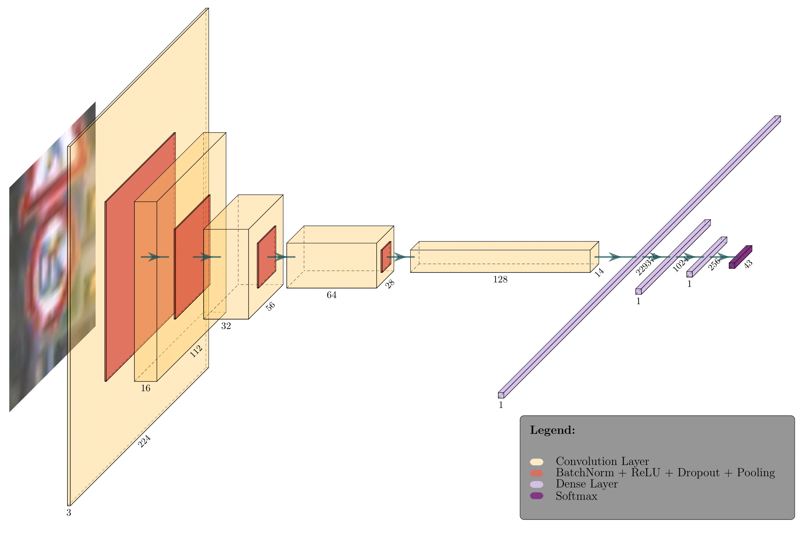
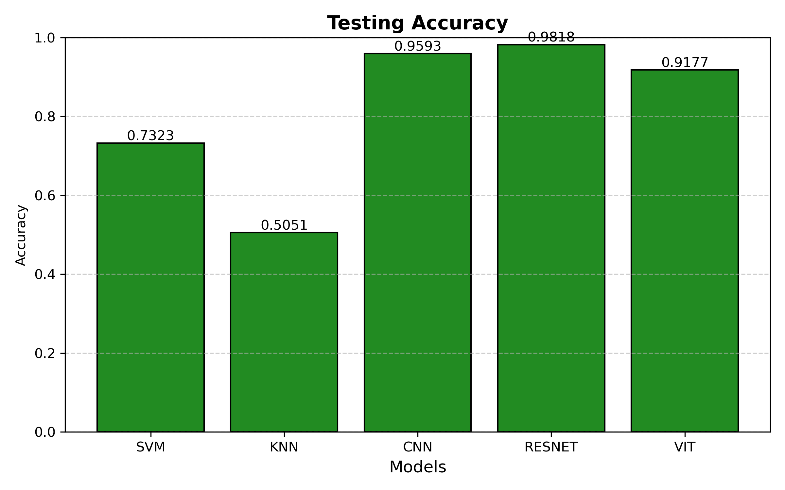
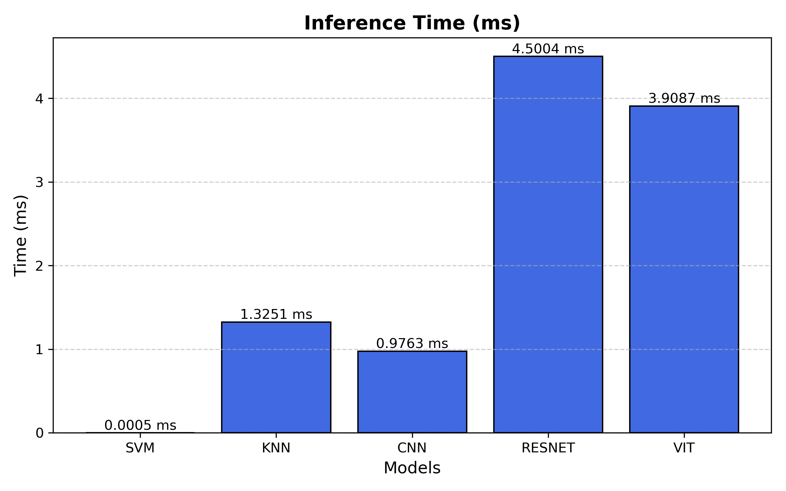

# Traffic Sign Recognition with Machine Learning

This repository contains the code for my final project in COMS 5730 Machine Learning course. The project compares the performance of different machine learning and deep learning models on the German Traffic Sign Recognition Benchmark (GTSRB) under challenging conditions, particularly focusing on occlusion scenarios.

## Dataset

The project uses the [German Traffic Sign Recognition Benchmark (GTSRB)](https://www.kaggle.com/datasets/meowmeowmeowmeowmeow/gtsrb-german-traffic-sign) dataset, which contains over 50,000 images of 43 different traffic sign classes. The images are real-world photos taken under various lighting and weather conditions, with the dataset being used widely in traffic sign recognition research.

## Project Overview

The goal of this project is to evaluate different machine learning models for traffic sign classification, especially under occlusion scenarios that autonomous vehicles may encounter in real-world environments. The project introduces random occlusion augmentation by adding black squares to images, simulating scenarios where signs might be partially blocked by objects like tree branches or other vehicles.

We evaluated:

- **CNN**: Custom Convolutional Neural Network
- **ResNet-50**: Pre-trained Residual Network with transfer learning
- **Vision Transformer (ViT)**: Pre-trained ViT with fine-tuning
- **Support Vector Machine (SVM)**: With PCA dimensionality reduction
- **K-Nearest Neighbors (KNN)**: With PCA dimensionality reduction

Performance was measured using accuracy and inference time, both critical factors for autonomous driving applications.

## Final Report

For a comprehensive analysis of our methodology, experiments, and findings, please see our [detailed final report](assets/COMS_573_Final_Project_Report.pdf). The report includes thorough explanations of:

- Our data augmentation approach with occlusion
- Model architectures and implementation details
- Experimental setup and evaluation metrics
- Complete results with visualizations
- In-depth discussion and conclusions

## Project Structure

```
.
├── algos/                  # Model implementations
│   ├── cnn.py              # Custom CNN implementation
│   ├── knn.py              # K-Nearest Neighbors implementation
│   ├── model.py            # Base model abstract class
│   ├── resnet.py           # ResNet50 implementation
│   ├── svm.py              # Support Vector Machine implementation
│   └── vit.py              # Vision Transformer implementation
├── utils/                  # Utility functions
│   ├── augmentation.py     # Data augmentation script
│   ├── dataset.py          # Custom dataset implementation
│   ├── logger.py           # Logging utilities
│   └── pca.py              # PCA dimensionality reduction
├── main.py                 # Main script to run experiments
├── experiment.py           # Experiment configuration
├── plotter.py              # Script for creating visualizations
├── prepare_datasets.sh     # Bash script for dataset preparation
├── prepare_datasets.ps1    # PowerShell script for dataset preparation
└── environment.yaml        # Conda environment specification
```

## Key Features

- **Data Augmentation**: Implements occlusion-based augmentation by adding 7 random black squares to images, simulating real-world partial obstruction of traffic signs.
- **Dimensionality Reduction**: Uses PCA to reduce feature dimensions for traditional ML models (SVM, KNN).
- **Transfer Learning**: Leverages pre-trained models (ResNet50, ViT) and fine-tunes them for the traffic sign classification task.
- **Performance Tracking**: Comprehensive logging of training metrics, testing accuracy, and inference time.
- **Visualization**: Generates comparison plots for model performance.

## Custom CNN Architecture

Our custom CNN architecture consists of stacked convolutional layers with batch normalization, ReLU activation, dropout, and max pooling:



## Experimental Results

Our experiments revealed significant differences in model performance:

### Accuracy

- **ResNet-50**: Achieved the highest testing accuracy of 98.18%
- **CNN**: Reached 95.93% accuracy
- **ViT**: Obtained 91.77% accuracy
- **SVM**: Achieved 73.23% accuracy
- **KNN**: Lowest performer with 50.51% accuracy
  

### Inference Time

- **SVM**: Extremely fast at 0.0005 ms per prediction
- **CNN**: Efficient at 0.9763 ms
- **KNN**: 1.3251 ms
- **ViT**: 3.9087 ms
- **ResNet-50**: Slowest at 4.5004 ms per prediction
  

### Key Findings

- **ResNet-50** offered the highest accuracy but at the cost of higher inference time, making it suitable for applications where precision is more critical than speed.
- **CNN** provided the best balance between accuracy and speed, making it most suitable for real-time traffic sign recognition systems.
- **SVM**, despite its lower accuracy, could be valuable in scenarios where extremely fast inference time is prioritized over accuracy.
- Data augmentation with occlusion helped improve model robustness to real-world scenarios.
- Transfer learning from pre-trained models proved highly effective for this task.

## Setup Instructions

### Environment Setup

1. Clone this repository:

   ```bash
   git clone https://github.com/nvan21/Traffic-Sign-Classification.git
   cd Traffic-Sign-Classification
   ```

2. Create the conda environment:

   ```bash
   conda env create -f environment.yaml
   ```

3. Activate the environment:
   ```bash
   conda activate traffic-sign-classification
   ```

### Dataset Preparation

Run the preparation script (choose based on your operating system):

For Linux/macOS:

```bash
chmod +x prepare_datasets.sh
./prepare_datasets.sh
```

For Windows:

```powershell
.\prepare_datasets.ps1
```

These scripts will:

1. Download the GTSRB dataset from Kaggle
2. Extract the dataset
3. Create augmented versions of the training data with random occlusions
4. Perform PCA dimensionality reduction

## Usage

### Running the Experiments

To run all model experiments:

```bash
python main.py
```

### Visualizing Results

After running the experiments, generate the performance comparison visualizations:

```bash
python plotter.py
```

This will create visualizations in the `images/` directory showing:

- Accuracy and loss curves for each model
- Comparison of inference times
- Comparison of testing accuracies

## Conclusion

While ResNet-50 offers the highest testing accuracy, the custom CNN struck an excellent balance between high accuracy and low inference time, making it the most suitable model for high-speed traffic sign recognition. The Vision Transformer showed promising results despite not matching CNN performance. SVM demonstrated remarkably fast inference time, which could be useful in situations where speed is prioritized over accuracy.

## Acknowledgements

- The German Traffic Sign Recognition Benchmark dataset creators
- PyTorch and scikit-learn libraries
- Course instructors and teaching assistants

---

**Authors**: Nathan Van Utrecht, Patrick Whitehouse
**Course**: COMS 5730 Machine Learning  
**Date**: August 2024 - December 2024
